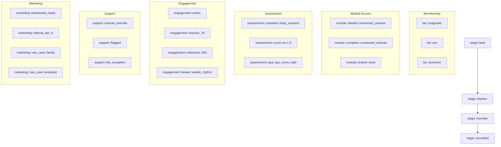

# Connected Health Tag Taxonomy 

## Purpose
Define a unified, cross-platform tagging structure for GHL and Membership.io that balances:
- Automation reliability
- User segmentation
- Feature access control
- Clean UX personalization

> ⚠️ Note: Tags are **secondary logic inputs only**. Core states (e.g. `membership_status`, `lab_status`) should be tracked as fields. Tags are used for **temporary, flexible flags** where structured fields are not viable.

---
> 📎 Related: See [CRM Tag Mapping Matrix](./crm-tag-mapping.md) for how tags are applied in workflows.
---

## 1. Lifecycle Tags
| Tag Name                | System      | Purpose                                  |
|------------------------|-------------|------------------------------------------|
| `stage::lead`          | GHL         | Pre-purchase funnel (cold lead)          |
| `stage::tripwire`      | GHL         | Purchased a tripwire but not joined      |
| `stage::member`        | GHL         | Active paying member                     |
| `stage::cancelled`     | GHL         | Past member, access revoked              |

---

## 2. Membership Tier Tags
| Tag Name                      | System       | Purpose                                 |
|------------------------------|--------------|-----------------------------------------|
| `tier::pragmatic`            | GHL          | Used to trigger tier-specific workflows |
| `tier::pro`                  | GHL          | --                                      |
| `tier::premium`              | GHL          | --                                      |
| `tier::migrated_from_v1`     | GHL          | Legacy mapping (optional cleanup)       |

---

## 3. Module Status Tags
| Tag Name                          | System          | Purpose                                |
|----------------------------------|------------------|----------------------------------------|
| `module::started::connected_cleanse` | GHL, M.io    | Module unlocked, tracking begun        |
| `module::complete::connected_cleanse`| GHL, M.io    | Module marked as finished              |
| `module::locked::reset`             | GHL           | For access gating UX                   |

> ✳️ Use module status tags to enable/disable access or route reminders.

---

## 4. Assessment Flags
| Tag Name                  | System          | Purpose                                 |
|--------------------------|------------------|-----------------------------------------|
| `assessment::complete::body_systems` | GHL    | Trigger post-assessment workflows       |
| `assessment::score::bs-1.3`          | GHL    | System priority flag (BS = body system) |
| `assessment::quiz::gut_score_high`   | GHL    | Gut sub-score routing flag              |

---

## 5. Engagement & Re-engagement
| Tag Name                    | System  | Purpose                                 |
|----------------------------|---------|-----------------------------------------|
| `engagement::active`       | GHL     | Recent login, quiz, or module activity  |
| `engagement::inactive_7d`  | GHL     | No tracked event in 7+ days             |
| `engagement::milestone::30d` | GHL   | Trigger monthly survey or prompt        |
| `engagement::streak::weekly_rhythm` | GHL | 3+ reflections in a row                 |

---

## 6. Support Flags
| Tag Name                    | System  | Purpose                                 |
|----------------------------|---------|-----------------------------------------|
| `support::manual_override` | GHL     | For admin-triggered logic bypass        |
| `support::flagged`         | GHL     | Member needs human follow-up            |
| `support::lab_exception`   | GHL     | Member in lab-ineligible state          |

---

## 7. Marketing & Referral
| Tag Name                      | System | Purpose                                  |
|------------------------------|--------|------------------------------------------|
| `marketing::testimonial_ready` | GHL  | Trigger testimonial request               |
| `marketing::referral_opt_in`  | GHL  | Ready for referral program                |
| `marketing::use_case::family` | GHL  | Segment for B2C family story              |
| `marketing::use_case::employer` | GHL | Segment for B2B sales logic               |

---

## 8. Visual Map of Tag Clusters

---

## 9. Tag-to-Field Mapping
| Tag Name                          | Related Field                 | Logic Purpose                       |
|----------------------------------|-------------------------------|-------------------------------------|
| `stage::member`                  | `membership_status`           | Reflects active status              |
| `tier::premium`                  | `membership_tier_current`     | Reinforces tier-level logic         |
| `module::complete::*`           | Supabase `module_engagements` | Syncs UI trigger to stored status   |
| `assessment::score::*`          | `current_system_code`         | Matches structured logic flag       |
| `engagement::*`                 | N/A                           | Lightweight behavior tags           |
| `support::lab_exception`        | `is_lab_eligible`             | UI flag to mirror structured field  |
| `marketing::testimonial_ready`  | N/A                           | Trigger for campaign automation     |

> ⚠️ Tags must never override structured field logic. They support UI states, segmentation, or temporary automation hooks.

---

## Governance Notes
- ✅ Tags should be created **programmatically** via Make.com whenever possible
- 🚫 Avoid adding decision logic in workflows based solely on tag presence
- 🧹 Use `tag::sync::*` only for 1-time sync (auto-delete after routing logic)
- 📆 Quarterly audit of orphaned or unreferenced tags should be scheduled

---

## Versioning Notes
- v1.0 includes first complete pass of lifecycle, access, and engagement flags
- Visual tag map and tag-to-field mapping added for implementation clarity
- Future versions may include campaign-specific tags (launches, promos)

---
